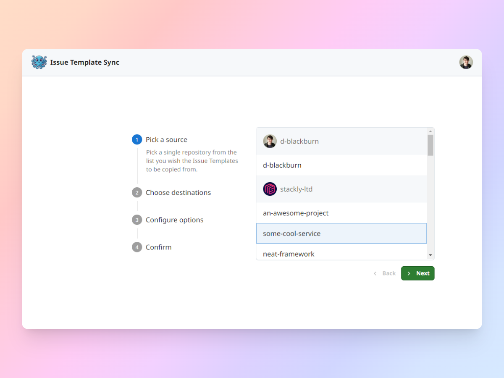
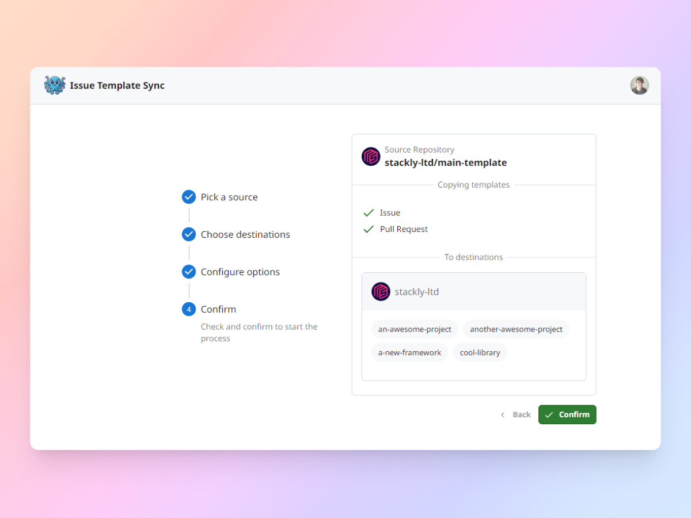
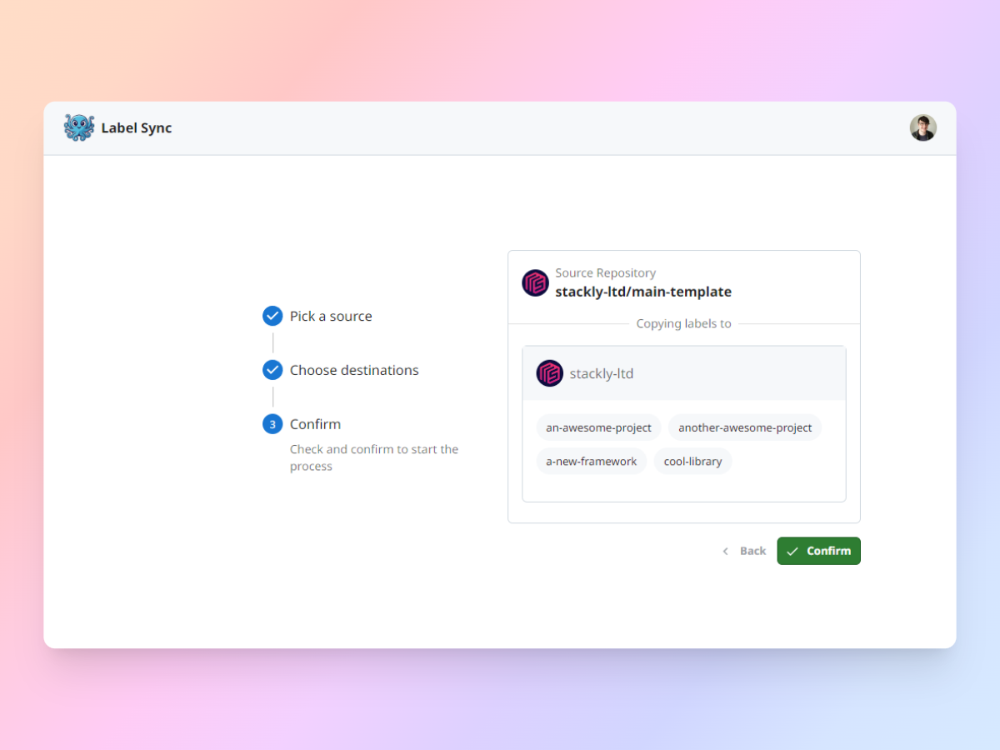

Build using <a href="https://github.com/electron-react-boilerplate/electron-react-boilerplate">Electron React Boilerplate</a>

---

## What is this?

OctoSync is an application designed to automate repetitive tasks in GitHub. If you're part of an organisation that contains
a lot of repositories in GitHub, you may find that maintaining consistency for things like Issue and Pull Request templates
can be quite tedious. Changes to one means changes to all - resulting in repeating the process of creating a branch,
making the changes, committing the work, making a Pull Request and finally merging the changes - for every repository.

Doing this whole process meets the literal dictionary definition of **FAFF** and was the motivation behind this application. 
Whilst it's relatively lackluster at the moment in terms of features, it's going to save myself (and hopefully you) a 
lot of time going through the above process.

## What can it do?

Whilst I'm more than happy to build on this further to reduce "high-faff" tasks, here is what it can do right now:

- **Template Syncing**: Copy all Issue and/or Pull Request templates from a source to multiple destinations repositories
- **Label Syncing**: Copy all repository labels from a source to multiple destination repositories

## Installation

### Windows

1. **Download the latest release:** Find the latest release of OctoSync in the [Releases](https://github.com/d-blackburn/octosync/releases) section.
2. **Install:** Download and run the installer for your operating system.

### Linux

Not supported yet

### Mac OS

Not support yet

## Usage

1. Connect OctoSync to your GitHub account.
2. Choose the organisations you want to use on OctoSync.
3. Profit... or just use the app (it's pretty simple right now)

## Screenshots

## Contributing

Feel free to submit fork off this repository and implement your own features that make your life
easier and minimise the faff you have to deal with. Alternatively, if you have a good idea for
a feature but don't have the time to implement it - make an issue!
